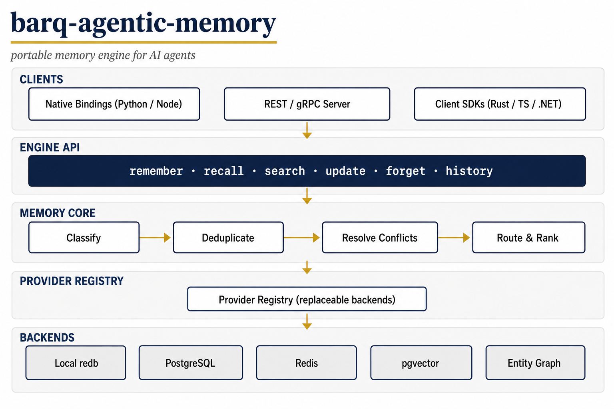

# barq-agentic-memory

<p align="center">
  
</p>

A standalone, high-performance, **framework-neutral memory engine** for AI
agents, written in Rust. Runs embedded in your process or as a server, and is
consumed by any agent or framework through native bindings, REST, or gRPC.

```text
remember() recall() search() update() forget() history()
```

Six public concepts. Under the hood: classification, routing, deduplication,
conflict resolution, indexing, hybrid retrieval, temporal validity,
provenance, retention, scoping.

- Five memory types: **working**, **episodic**, **semantic**, **procedural**,
  **prospective**.
- Provider-based storage: local embedded file → PostgreSQL → Redis → vector
  and graph stores. Swap backends without changing the API.
- Bitemporal facts with supersession history — older truths are retired,
  never silently destroyed.
- Works with zero LLM dependency when callers supply structured memories.

## Architecture

<p align="center">
  
</p>

Five layers: clients (bindings / server / SDKs) → the six-concept engine API →
the memory core (classify → deduplicate → resolve conflicts → route & rank) →
the provider registry → replaceable backends (local redb, PostgreSQL, Redis,
pgvector, entity graph). Full details in
[`docs/architecture.md`](docs/architecture.md).

## Status

Under active development, phase by phase (see
[`docs/phase-log.md`](docs/phase-log.md) and
[`docs/architecture.md`](docs/architecture.md)).

| Release | Scope | Status |
|---|---|---|
| v0.1 | domain + local embedded CRUD | done (phase 01) |
| v0.2 | PostgreSQL + Redis | done (phases 02-03) |
| v0.3 | pgvector semantic recall | done (phase 04) |
| v0.4 | classification + deduplication | done (phases 07-08) |
| v0.5 | conflicts + temporal truth | done (phase 09) |
| v0.6 | episodic + Python binding | done (phases 10, 16) |
| v0.7 | server mode | done (phase 18) |
| v0.8 | graph + procedural + prospective | done (phases 11-13) |
| v0.9 | governance + lifecycle + advanced retrieval | done (phases 05-06, 14-15) |
| v1.0 | stable provider API, embedded/server modes, SDKs, observability, HA guidance | SDKs/reliability/scale-out done (19-22); observability hardening remains |

All 24 blueprint phases implemented; see docs/phase-log.md for the full
ledger and docs/native-index-roadmap.md for the deliberately deferred
index work.

## Development

```bash
cargo build --workspace   # compile everything
cargo test --workspace    # run all tests
./scripts/gate.sh         # fmt + clippy -D warnings + tests
```

Licensed under Apache-2.0.
